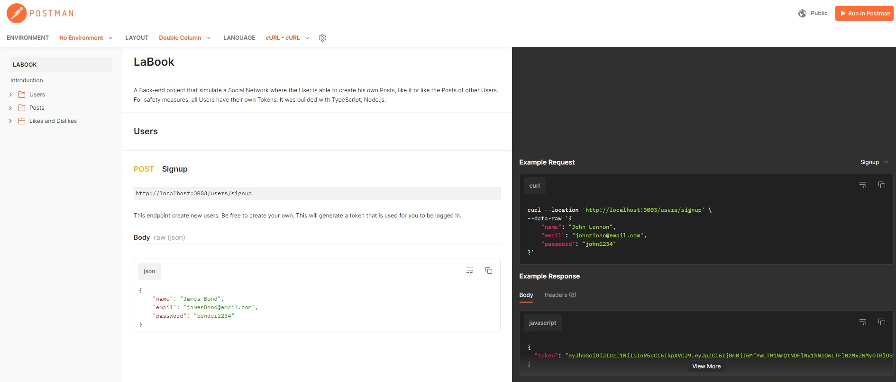

# **Projeto Labook**


## **Índice**
- <a href='#sobre-o-projeto'>Sobre o Projeto</a>
- <a href='#getting-started'>Getting Started</a>
- <a href='#documentacao'>Documentação</a>
- <a href='#funcionalidades-do-projeto'>Funcionalidades do Projeto</a>
- <a href='#banco-de-dados'>Banco de dados</a>
- <a href='#tecnologias-usadas'>Tecnologias usadas</a>
- <a href='#pessoas-autoras'>Pessoas autoras</a>

## **Sobre o Projeto**
O Labook é uma rede social com o objetivo de promover a conexão e interação entre pessoas. Quem se cadastrar no aplicativo poderá criar e curtir publicações.

Nesse projeto foram aplicados os conceitos de implementação de segurança e códigos mais escaláveis, tais como Arquitetura em camadas, Programação Orientada a Objetos(POO), senhas com hash(protegidas). Os usuários para estarem logados precisavam de um token autenticado e autorizado.

## **Getting Started**
Instruções de como iniciar o projeto no seu dispositivo local, basta seguir os seguintes comandos.

### **Instalação**
1. Clone o repositório
	```sh
	git clone link-do-repositório
	```
2. Entrar na pasta
    ```sh
    cd pasta-do-repositório
    ```
3. Instalar os pacotes NPM(Caso estejam faltando)
	```sh
	npm install
	```
4. Rodar o projeto
    ```sh
	npm run dev
	```


## **Documentação**

https://documenter.getpostman.com/view/24460718/2s93CPrsHg

## **Funcionalidades do Projeto**
- Endpoints
    - [x]  signup
    - [x]  login
    - [x]  get posts
    - [x]  create post
    - [x]  edit post
    - [x]  delete post
    - [x]  like / dislike post

## **Banco de dados**


https://dbdiagram.io/d/63d16443296d97641d7c1ae1

## **Tecnologias utilizadas**

- NodeJS
- Typescript
- Express
- SQL e SQLite
- Knex
- POO
- Arquitetura em camadas
- Geração de UUID
- Geração de hashes
- Autenticação e autorização
- Roteamento
- Postman

## **Pessoas autoras**

Bruno Maschietto.
